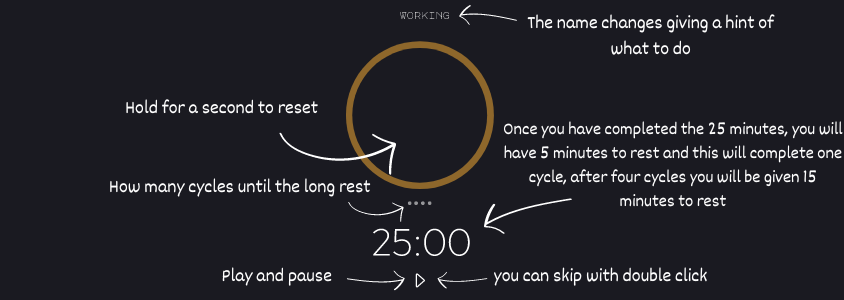

# Pomoeclipse
> A simple, practical, quick and beautiful pomodoro 

<p align="center">
    <a href="#Usage-Example"> Usage Example</a> ⚬
    <a href="#Update-History"> Update History</a> ⚬
    <a href="#Meta"> Meta</a>
</p>

<div align="center"> <!--Icon-->
   
</div>

As a pomodoro you will have 25 minutes to study or work. When those 25 minutes are up, you'll get 5 minutes to rest, a short rest and that completes one cycle, and when you've completed four cycles you'll get a long rest.

## Usage Example
As mentioned above, you can use it to increase your productivity both in your studies and at work, without wearing yourself out.
I recommend studying or working while listening to lo-fi :)
**Now a short tutorial on how to use pomoeclipse:**

**How the code starts and pauses**
```js
function startStop() {
    audStartStop.play();
    if (isRunning) {
        clearInterval(timer);
        isRunning = false;
        playerPause.setAttribute('class','bi-caret-right');
    } else {
        timer = setInterval(countdown, 1000);
        isRunning = true;
        playerPause.setAttribute('class','bi-pause');
    }    
}
```
**How the code resets**
```js
// Reset action to be performed after 1 second
document.getElementById('reset').addEventListener('mousedown', () => {
    timeoutId = setTimeout(() => {
        clearInterval(timer);
        audReset.play();
        isRunning = false;
        document.getElementById('timer-label').innerText = 'Working';
        document.getElementById('time-left').innerText = '25:00';
        wheel.style.stroke='#8E672B'
        wheel.style.strokeDashoffset = 0;
        playerPause.setAttribute('class','bi-caret-right')
        //Clear all Cir and reset
        CirRoll = 0;
        for(let i=0;i<4;i++){
            allCir[i].style.color='#ffffff77';
        }
    }, 1000);
});

// Do not execute if aborted before 1 second
document.getElementById('reset').addEventListener('mouseup', () => {
    clearTimeout(timeoutId);
});
```
**How the code skips**
```js
function skip(){
    playerPause.setAttribute('class','bi-skip-end');
    audSkip.play()
    playerPause.style.transition = '.5s'
    document.getElementById('time-left').innerText = '00:00';
}
```
I invite you to test the application and read the code, I welcome tips and advice <3

[Click me](https://felixclone.github.io/pomoeclipse/)


## Update History
* 0.0.1
    * Initial project


## Meta

<a href="mailto:contato.valtsdigital@protonmail.com?subject=Pomoeclipse&body=Hello i wanna talk about pomoeclipse">  </a>

Distributed under license. See `IMT LICENSE` for more information.

<a href="https://github.com/FelixClone">  </a>